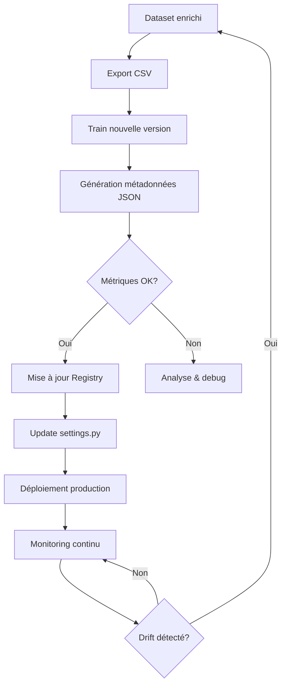

# 📊 Model Registry - Future Skills ML

Ce fichier maintient un registre centralisé de toutes les versions du modèle ML Future Skills, permettant la traçabilité et la comparaison des performances.

## 📋 Historique des Modèles

| Version | Date       | Dataset                   | Samples | Accuracy | F1-Score | N_estimators | Notes                            |
| ------- | ---------- | ------------------------- | ------- | -------- | -------- | ------------ | -------------------------------- |
| v1      | 2025-01-XX | future_skills_dataset.csv | ~XXX    | X.XX%    | X.XXXX   | 200          | Modèle initial avec RandomForest |

## 📝 Détails par Version

### Version v1 (Baseline)

- **Date d'entraînement**: À définir lors du premier entraînement
- **Dataset**: future_skills_dataset.csv
- **Features utilisées**:
  - Catégorielles: job_role_name, skill_name, skill_category, job_department
  - Numériques: trend_score, internal_usage, training_requests, scarcity_index, hiring_difficulty, avg_salary_k, economic_indicator
- **Hyperparamètres**:
  - n_estimators: 200
  - class_weight: balanced
  - random_state: 42
- **Métriques**:
  - À compléter après premier entraînement
- **Fichiers**:
  - Modèle: `future_skills_model_v1.pkl`
  - Métadonnées: `future_skills_model_v1.json`
- **Changements**: Modèle initial de référence

---

## 🎯 Guide d'Utilisation

### Comment entraîner une nouvelle version

```bash
# 1. Exporter le dataset actuel
python manage.py export_future_skills_dataset

# 2. Entraîner avec une nouvelle version
python ml/train_future_skills_model.py \
  --version v2 \
  --n-estimators 300 \
  --output ml/future_skills_model_v2.pkl

# 3. Mettre à jour ce registre avec les métriques obtenues
```

### Comment comparer deux versions

```bash
# Consulter les métadonnées JSON
cat ml/future_skills_model_v1.json
cat ml/future_skills_model_v2.json

# Utiliser le script d'évaluation
python ml/evaluate_future_skills_models.py
```

### Comment déployer une nouvelle version

1. Vérifier les métriques dans le fichier `.json` correspondant
2. Mettre à jour `config/settings.py`:
   - `FUTURE_SKILLS_MODEL_PATH` → pointer vers le nouveau `.pkl`
   - `FUTURE_SKILLS_MODEL_VERSION` → mettre à jour la version
3. Redémarrer le serveur Django
4. Documenter le changement dans ce registre

---

## 📊 Critères de Performance

### Métriques Clés

- **Accuracy globale**: objectif > 80%
- **F1-Score weighted**: objectif > 0.75
- **Précision par classe**:
  - LOW: > 75%
  - MEDIUM: > 70%
  - HIGH: > 80%

### Critères de Mise en Production

Un nouveau modèle peut être déployé en production si:

- ✅ Accuracy ≥ version précédente OU amélioration F1 > 0.02
- ✅ Aucune classe avec précision < 60%
- ✅ Testé sur un échantillon de validation manuel
- ✅ Approuvé par l'équipe Data/DRH

---

## 🔄 Workflow MLOps



---

## 🚨 Troubleshooting

### Dégradation des performances

Si un nouveau modèle performe moins bien:

1. Vérifier la distribution des classes dans le dataset
2. Comparer les feature importances entre versions
3. Analyser les prédictions erronées
4. Considérer un rollback vers la version précédente

### Data Drift

Signes de drift à surveiller:

- Baisse progressive de l'accuracy en production
- Nouvelles valeurs de features hors distribution d'entraînement
- Changements dans les tendances du marché

---

## 📚 Références

- Script d'entraînement: `ml/train_future_skills_model.py`
- Script d'évaluation: `ml/evaluate_future_skills_models.py`
- Documentation MLOps: `ml/MLOPS_GUIDE.md`
- Configuration: `config/settings.py`

---

**Dernière mise à jour**: {{ À mettre à jour à chaque nouveau modèle }}
**Responsable**: Équipe Data / DRH
